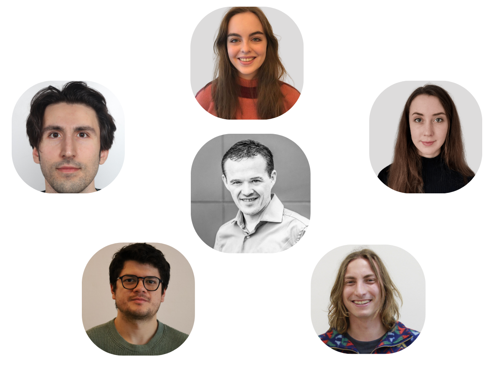


 
<section 
  style="
    background-size: cover;
    background-position: center;
    padding: 1rem 1rem;
    text-align: center;
    color: #4fc067;
    align-items: center;
  "
>
  <h2 
    style="
      font-size: 3rem;
      font-weight: bold;
      margin-bottom: 1rem;
    "
  >
    <strong>BioML - Machine Learning for Life Sciences</strong>
  </h2>

  
</section>

<section class="two-column-section-index">
  

    <!-- LEFT SIDE: Title, Text, and Buttons -->
    

      

        The BIO-ML research group of <strong>Ghent University</strong> focusses on the 
        development of <strong>machine learning methods</strong> for the life sciences. 
        Specific research areas of interest are <strong>multi-target prediction</strong>, 
        <strong>sequence learning</strong>, <strong>time series analysis</strong>, 
        <strong>uncertainty quantification</strong> and <strong>probabilistic models</strong>. 
      

 
 
      

        <a href="/bioml/research" class="btn">Our Research</a>
        <a href="/bioml/team" class="btn">Our Team</a>
        <a href="/bioml/contact" class="btn">Contact Us</a>
      

    

    <!-- RIGHT SIDE: Image -->
    

      
    

  

</section>


